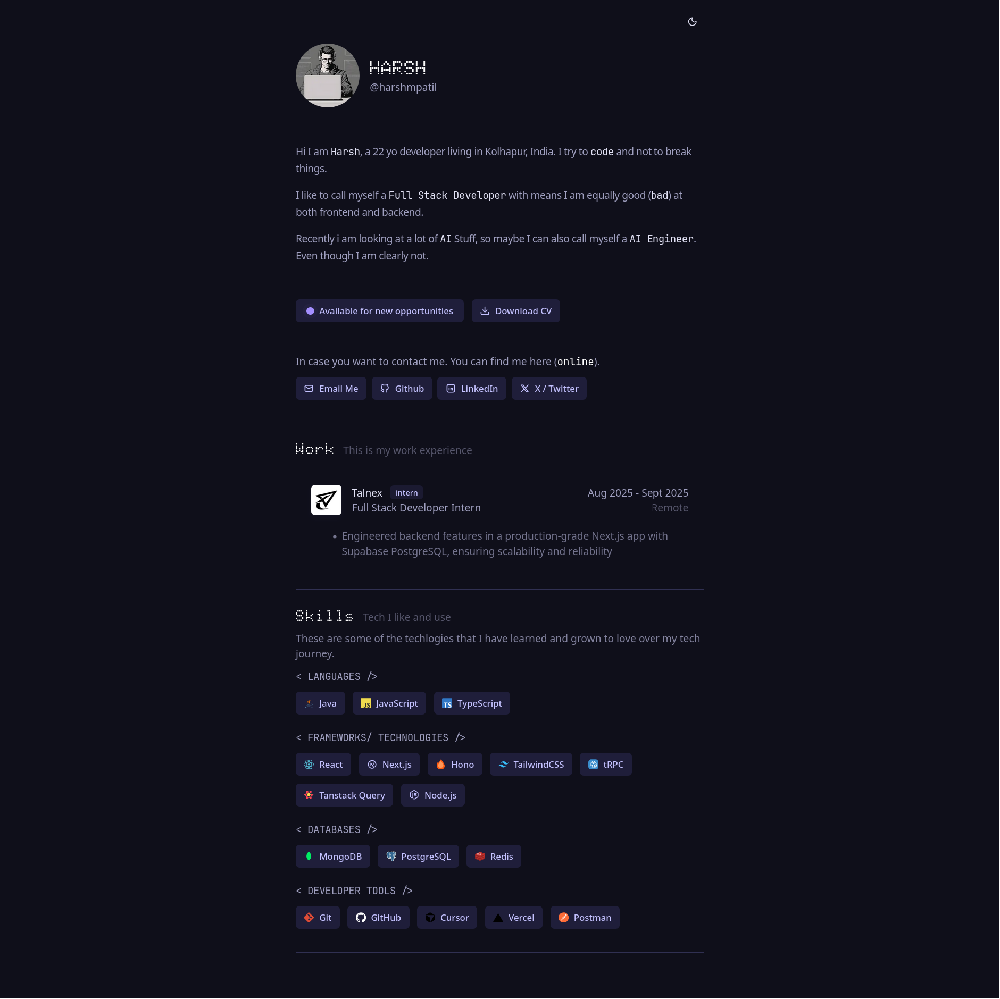

# Portfolio



A modern, responsive portfolio built with **Next.js 15**, **React 19**, and **Tailwind CSS 4** — perfect for showcasing your projects and skills.

## Features

* Clean dark/light UI with smooth animations
* Fully responsive design
* Theme toggle (dark/light)
* Accessible and SEO-friendly
* Fast development with Turbopack
* Easy to customize

## Quick Start

```bash
# Clone the repository
git clone <repository-url>
cd portfolio

# Install dependencies
pnpm install

# Start the development server
pnpm dev
```

Open [http://localhost:3000](http://localhost:3000) in your browser.

## Project Structure

```
src/
 ├─ app/          # Pages and routes
 ├─ components/   # UI components
 └─ lib/          # Utilities
public/           # Static assets
```

## Customization

* Edit personal info in `src/app/page.tsx`
* Replace profile image in `public/`
* Update skills, experience, and links in components
* Modify colors in `globals.css`

## Tech Stack

* **Next.js 15**, **React 19**, **TypeScript**
* **Tailwind CSS**, **Radix UI**, **Lucide Icons**
* **Biome**, **Turbopack**, **next-themes**

## Scripts

```bash
pnpm dev      # Development server
pnpm build    # Build for production
pnpm start    # Run production server
pnpm lint     # Lint code
pnpm format   # Format code
```

## Deployment

Deploy on **Vercel** or any Node.js host:

```bash
pnpm build && pnpm start
```

## License
I don't care you can do whatever you want with this code.

Built by [@harsh-m-patil](https://github.com/harsh-m-patil)
