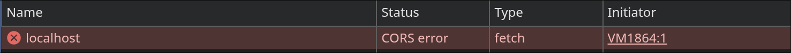
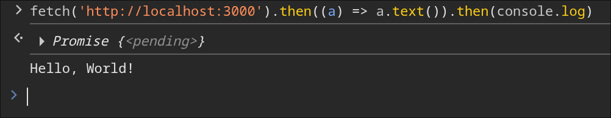
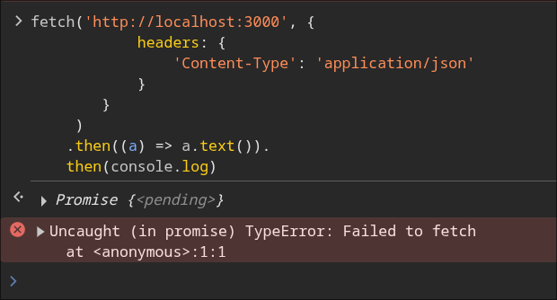
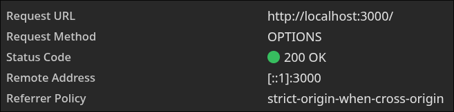
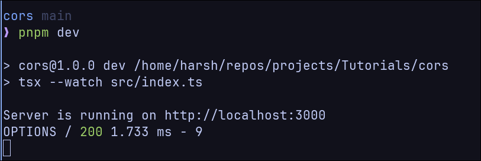
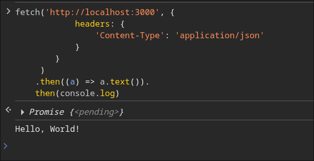

If you've ever tried to fetch data or access a resource from a different origin, you’ve probably encountered a **CORS error**.

## What is CORS?

**CORS** (Cross-Origin Resource Sharing) is a security mechanism enforced by browsers. It restricts web applications running on one origin (domain + protocol + port) from interacting with resources on a different origin unless the server explicitly allows it.



## How does CORS work?

By default, browsers block cross-origin requests to protect users from malicious sites. When you try to access a resource from a different origin, the **server** must include specific CORS headers in its response to tell the browser which origins are allowed.

If the browser finds that the origin you're requesting **is not allowed**, it blocks access—even if the request reaches the server and the server responds.

<Callout title="Note">
 This restriction is enforced only by browsers. If you use `curl`, `Postman`, or server-side code, CORS does **not** apply—because the check happens in the **browser**, not on the server.
</Callout>

---

## The CORS Flow

Here’s a simplified flow of what happens during a CORS request:

1. The browser adds an `Origin` header to the outgoing request.
2. The server checks the `Origin` and, if allowed, includes an `Access-Control-Allow-Origin` header in the response.
3. The browser compares the two.
4. If the origin is allowed, the browser proceeds. Otherwise, it blocks access.

---

## What is a Preflight Request?

Some requests are considered “**complex**” by the CORS specification. In such cases, the browser first sends a **preflight** request using the `OPTIONS` method to ask the server for permission **before** sending the actual request.

If the server approves (by responding with the right headers), the actual request is sent.

---

## What Makes a Request "Complex"?

According to the CORS spec, a request is **preflighted** if:

- It uses **HTTP methods** other than `GET`, `POST`, or `HEAD`.
- It sets **custom headers** not part of this safe list:
  `Accept`, `Accept-Language`, `Content-Language`, or `Content-Type`.
- It uses a **Content-Type** other than one of:
  - `application/x-www-form-urlencoded`
  - `multipart/form-data`
  - `text/plain`

---

## Let's get our hands dirty!

Now that we understand what CORS is and how it works, let's build our own CORS middleware in TypeScript to get a deeper understanding. This will also help you appreciate what libraries like `cors` or `@hono/cors` do under the hood.

### First, let's set up a basic Express server:

```typescript title='src/index.ts'
import express from "express";
import morgan from "morgan";

const app = express();
app.use(morgan("dev"));

app.get("/", (req, res) => {
  res.send("Hello, World!");
});

app.listen(3000, () => {
  console.log("Server is running on http://localhost:3000");
});
```

If i try to access this server from a different origin in the browser for example, `http://localhost:4321`, I will get a CORS error.
NOTE: I have a different website running on port 4321, you can use any other port or domain.


### Added `Access-Control-Allow-Origin` header

We need a way to tell the browser that the given origin is allowed.
We can do this by adding the `Access-Control-Allow-Origin` header to the response.

```typescript title='src/index.ts'
import express from "express";
import morgan from "morgan";

const app = express();
app.use(morgan("dev"));

app.get("/", (req, res) => {
  res.setHeader("Access-Control-Allow-Origin", "*");
  res.send("Hello, World!");
});

app.listen(3000, () => {
  console.log("Server is running on http://localhost:3000");
});
```

<Callout title="Warning" type="error">
  `Access-Control-Allow-Origin: '*'` should not be used in production as it allows any origin to access your resource, which can lead to security vulnerabilities. Instead, mention the particular origins specifically as comma separated values.

  `Access-Control-Allow-Credentials: true` cannot be used with wildcard `*`.
</Callout>

<Callout>
But as this is just a demo, we can use `*` to allow any origin.
</Callout>

---

- Now we have added the `Access-Control-Allow-Origin` header to the response, which allows any origin to access this resource. If you try to access it from `http://localhost:4321`, it should work without any CORS errors.



---

### Making a Complex Requests

- Now let's try a different request
  

We are seeing a CORS error because our request is classified as “complex” (due to the custom Content-Type: application/json), which requires a preflight OPTIONS request. Our server doesn’t yet handle this correctly, so the browser blocks the actual request.

- OPTIONS request is made to the server to check if the actual request is allowed.



- If we look at the terminal, we can see the `OPTIONS` request being logged by `morgan`.
  The OPTIONS request succeeds, but since the response does not include the required CORS headers, the browser blocks the actual GET request from being sent.



These are the headers of the preflight request made by the browser:

```bash {" ":5-6}
OPTIONS / HTTP/1.1
Accept: */*
Accept-Encoding: gzip, deflate, br, zstd
Accept-Language: en-GB,en-US;q=0.9,en;q=0.8
Access-Control-Request-Headers: content-type
Access-Control-Request-Method: GET
Cache-Control: no-cache
Connection: keep-alive
Host: localhost:3000
Origin: http://localhost:4321
Pragma: no-cache
Referer: http://localhost:4321/
Sec-Fetch-Dest: empty
Sec-Fetch-Mode: cors
Sec-Fetch-Site: same-site
User-Agent: Mozilla/5.0 (X11; Linux x86_64) AppleWebKit/537.36 (KHTML, like Gecko) Chrome/138.0.0.0 Safari/537.36
```

The browser is asking the server if it allows the `GET` method with the `content-type` header.

We get an empty response from the header with the following headers:

```bash
HTTP/1.1 200 OK
X-Powered-By: Express
Allow: GET, HEAD
Content-Length: 9
Content-Type: text/plain
X-Content-Type-Options: nosniff
Date: Tue, 22 Jul 2025 14:01:37 GMT
Connection: keep-alive
Keep-Alive: timeout=5
```

Because we’re not using a CORS library like cors, we must manually handle the preflight request by responding to OPTIONS with the correct Access-Control-Allow-\* headers. By default, Express responds with a 200 OK status, but it does not include the necessary CORS headers.

### Adding `Access-Control-Allow-Headers` header

```typescript title='src/index.ts'
import express from "express";
import morgan from "morgan";

const app = express();
app.use(morgan("dev"));

app.get("/", (req, res) => {
  res.setHeader("Access-Control-Allow-Origin", "*");
  res.send("Hello, World!");
});

app.options("/", (req, res) => {
  res.setHeader("Access-Control-Allow-Origin", "*");
  res.setHeader("Access-Control-Allow-Headers", "Content-Type");
  return res.status(204).send();
});

app.listen(3000, () => {
  console.log("Server is running on http://localhost:3000");
});
```

_HTTP 204 No Content means “I understood and accepted the request but don’t return any data.”_

- Now we have added an `OPTIONS` endpoint that responds with the appropriate CORS headers.

- These are the headers of the response made by the server to the preflight `OPTIONS` request:

```bash {" ":3-4}
HTTP/1.1 204 No Content
X-Powered-By: Express
Access-Control-Allow-Origin: *
Access-Control-Allow-Headers: Content-Type
Date: Tue, 22 Jul 2025 14:07:12 GMT
Connection: keep-alive
Keep-Alive: timeout=5
```

As the browser now gets the `Access-Control-Allow-Origin` and `Access-Control-Allow-Headers` headers, it allows the actual request to be made. And we get the following response:



- You can add more allowed headers by adding them as comma separated values in the `Access-Control-Allow-Headers` header.
- If we want to allow more methods, we can add the `Access-Control-Allow-Methods` header.

```typescript title='src/index.ts'
import express from "express";
import morgan from "morgan";

const app = express();
app.use(morgan("dev"));

app.get("/", (req, res) => {
  res.setHeader("Access-Control-Allow-Origin", "*");
  res.send("Hello, World!");
});

app.post("/", (req, res) => {
  res.send("Hello, World! from POST");
});

app.options("/", (req, res) => {
  res.setHeader("Access-Control-Allow-Origin", "*");
  res.setHeader("Access-Control-Allow-Headers", "Content-Type");
  res.setHeader("Access-Control-Allow-Headers", "Content-Type, Authorization");

  res.setHeader(
    "Access-Control-Allow-Methods",
    "GET, POST, PUT, DELETE, OPTIONS",
  );
  return res.status(204).send();
});

app.listen(3000, () => {
  console.log("Server is running on http://localhost:3000");
});
```

## Summary

In this post, we:

- Understood what CORS is and why it exists
- Learned how preflight requests work and when they occur
- Added manual CORS support using headers and an `OPTIONS` endpoint
- Saw how the browser enforces CORS and blocks non-compliant responses
